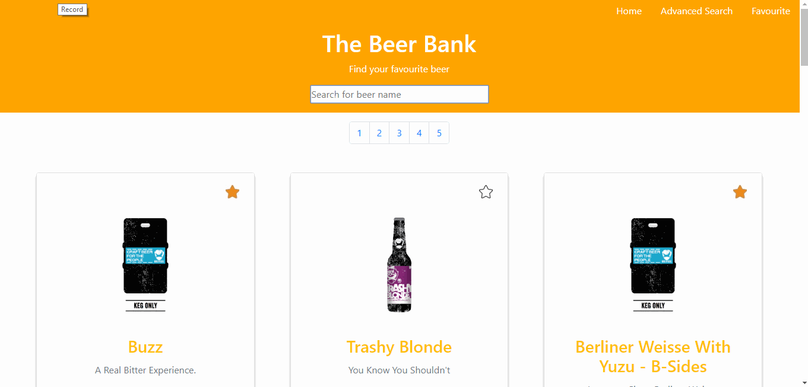
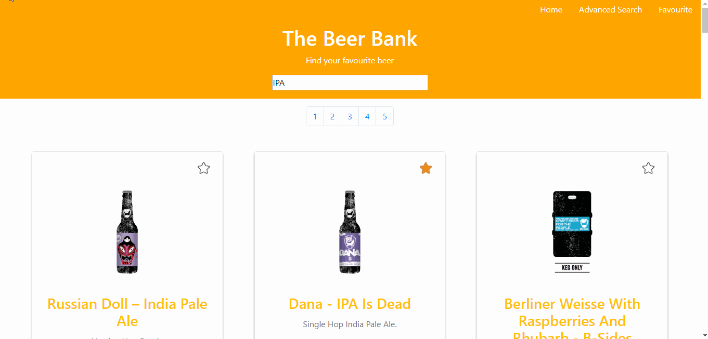
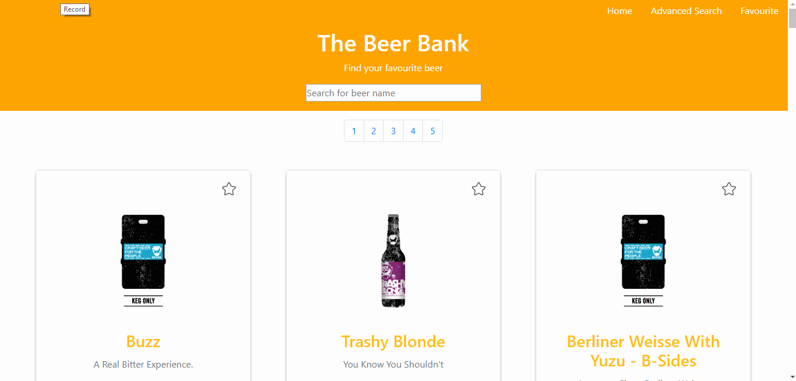

# The Beer Bank - A frontend challenge

The Beer Bank Challenge is a frontent project used to study and explore APIs and JQuery. Some techs used: JQuery, HTML, CSS, Javascript and Bootstrap. This web application uses and consumes The Punk API, a powerful source of data about good beer<a href="https://punkapi.com/"> click here </a> to check their website for more information and API documentaion.

Here you can see some screens of this web application:

 
 

 
 

 
 

  
 
 

O Beer Bank Challenge é um projeto de frontend usado para estudar e explorar APIs e JQuery. Algumas técnologias utilizadas: JQuery, HTML, CSS, Javascript e Bootstrap. Este aplicativo da Web usa e consomea The Punk API, uma poderosa fonte de dados sobre boa cerveja <a href="https://punkapi.com/"> clique aqui </a> para verificar seu site para obter mais informações e documentação da API.
